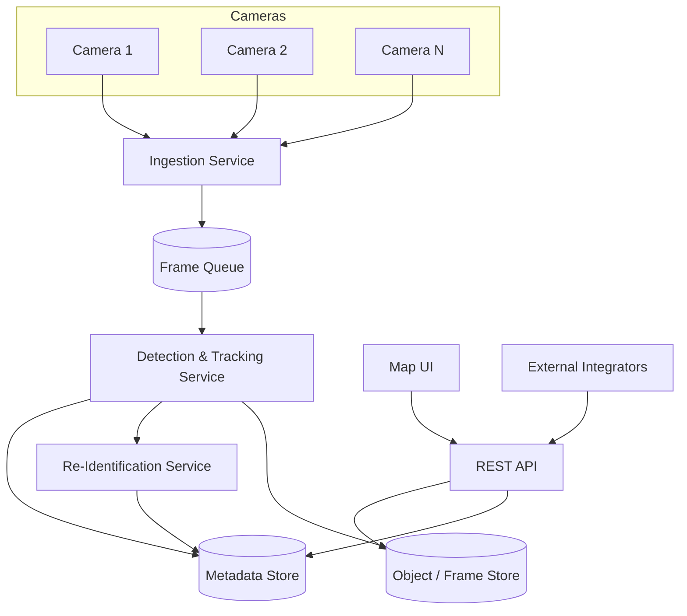
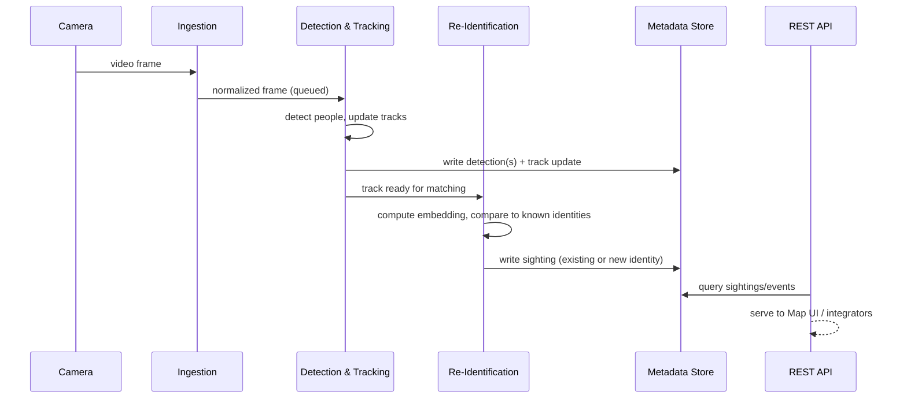
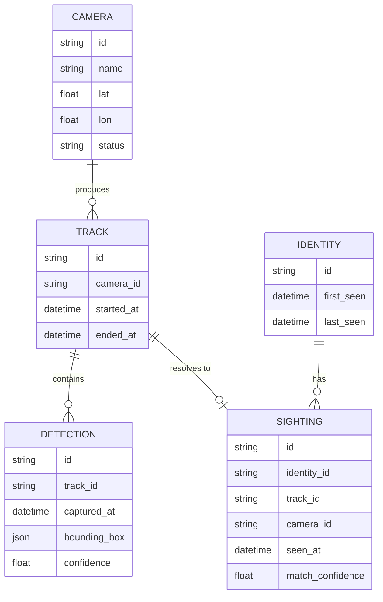
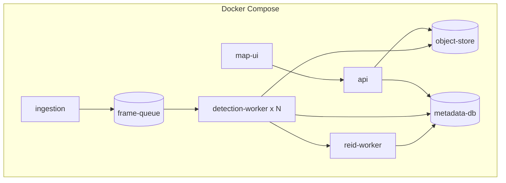

# Architecture

This describes the shape of the system: components, data flow, and deployment topology. It intentionally does not pin specific frameworks, models, or databases — those are tracked as individual decisions in docs/DECISIONS.md as they're made. What's fixed here is *responsibility boundaries*, because those are expensive to change later; specific libraries are cheap to swap and don't belong in an architecture doc.

## 1. Components

- **Ingestion Service** — connects to each camera's stream, normalizes frame rate/resolution, and pushes frames onto a queue per camera. Owns start/stop lifecycle for a camera's ingestion. A dropped camera connection is retried here and must not affect other cameras.
- **Detection & Tracking Service** — consumes frames, runs an object detector, and maintains per-camera tracks (associating detections across consecutive frames into a single trajectory). Writes track and detection records, and stores representative frame crops in the object store. Scales horizontally — one or more workers can each own a subset of cameras.
- **Re-Identification Service** — takes a finished or in-progress track, computes an embedding, and matches it against known identities. Creates a new identity when nothing clears the match threshold, otherwise appends a sighting to an existing identity. This is the component that answers "have we seen this person before, on any camera."
- **Metadata Store** — structured, queryable storage for cameras, tracks, detections, identities, and sightings. This is what the API reads from for anything other than raw media.
- **Object / Frame Store** — holds raw video segments and frame crops referenced by detections/tracks. Kept separate from the metadata store because it's large, cheap-per-byte, and has different retention rules than structured metadata.
- **REST API** — the only supported way to read or write platform state from outside. See docs/API_SPEC.md for the contract. Talks to the metadata store and object store; never talks to cameras directly.
- **Map UI** — a client of the REST API, nothing more. Renders camera locations and recent sightings.

## 2. Data flow — one frame's journey

Detection happens on every track update; re-identification is triggered less frequently (e.g., when a track closes, or on an interval for long-lived tracks) since it's the more expensive comparison step and doesn't need to run per-frame.

## 3. Data model

A **track** is one continuous observation of a subject on one camera. An **identity** is the cross-camera concept — a cluster of tracks the re-id service believes are the same person. A **sighting** links a track to an identity with a confidence score; this indirection is what makes operator merge/split correction (FR-6) possible without mutating raw detections.

## 4. Deployment topology

Each box is a container; `detection-worker` is the one expected to scale out as camera count grows. `frame-queue` decouples ingestion from detection so a slow detection worker doesn't stall camera reads. Which concrete queue, database, and object store technology fill these roles is an open decision (docs/DECISIONS.md) — the topology doesn't depend on the choice.

## 5. Scaling considerations

- Detection workers should be assignable to a subset of cameras so throughput scales roughly linearly with worker count.
- Re-identification comparisons grow with the number of known identities; this is the component most likely to need an index/ANN search structure rather than brute-force comparison once identity count is large.
- Raw video is the dominant storage cost. Expect a tiered retention policy: short hot window for full video, longer retention for frame crops and metadata only.
- The metadata store is the API's read path — it should stay small and indexable; it is not where video lives.

## 6. Security & privacy

- Video and biometric-like data (embeddings, face/body crops) are sensitive by default. The REST API is the single enforcement point for access control — nothing outside it talks to storage directly.
- Retention limits (PRD NFR) must be enforced by a scheduled process, not left as a manual cleanup task.
- Logs and metrics should reference record IDs, not embed raw frames or embeddings.

## 7. Stack status

Concrete technology choices (detector/tracker model, re-id embedding model, database engine, message queue, map library, frontend framework) are intentionally not pinned in this document. Track their status in docs/DECISIONS.md; each will land as its own ADR before the component it affects is implemented.
