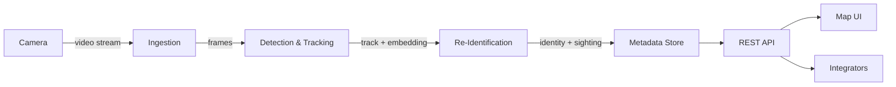

# Product Requirements Document

## 1. Summary

A platform that ingests video from multiple cameras, detects and tracks people within each camera's view, and re-identifies the same person as they move between cameras. Detections, tracks, and identity matches are written to a metadata store and exposed through a REST API, with a map view showing where activity is currently happening.

This replaces an earlier single-camera, single-photo face-tagging prototype that had no video ingestion, no tracking, and no way to correlate a person across more than one camera.

## 2. Problem

Security teams running more than a handful of cameras can't manually watch every feed. They need the system to tell them *who moved where*, not just record footage they'll review after the fact. That requires three things the prototype didn't have: continuous video ingestion instead of one-shot photo upload, tracking of individuals within a feed instead of per-frame detection, and a way to say "the person camera 3 saw at 14:02 is the same person camera 7 saw at 14:05."

## 3. Goals

- Ingest live or recorded video from multiple cameras concurrently.
- Detect and track people (and optionally other object classes) within a single camera's field of view.
- Re-identify the same subject across different cameras and across gaps in time.
- Persist structured, queryable metadata: detections, tracks, identities, events.
- Show camera locations and recent activity on an interactive map.
- Expose ingestion, query, and management functionality through a documented REST API.
- Ship as Docker containers that come up with a single command.
- Cover core pipeline and API logic with automated tests.

## 4. Non-goals

- Verifying identity against a government ID or other external biometric registry. The system only recognizes people an operator has explicitly enrolled.
- Real-time push alerting (SMS/email/webhook notifications). Reasonable follow-on once events are flowing reliably, not part of this scope.
- A mobile client app.
- Multi-tenant billing or organization-level account management.

## 5. Users

- **Security operator** — watches the map, reviews recent events, searches "where has this person been today."
- **Administrator** — registers cameras, sets retention policy, deploys and upgrades the platform.
- **Integrator** — consumes the REST API to build custom tooling or feed another system.

## 6. Functional requirements

| ID | Requirement |
|----|-------------|
| FR-1 | Register, update, and remove cameras, including their map location. |
| FR-2 | Start/stop ingestion of a camera's video stream. |
| FR-3 | Detect people in each ingested frame and track them within a camera's view across frames. |
| FR-4 | Generate a re-identification embedding for each track. |
| FR-5 | Match tracks against known identities across cameras and time; create a new identity when no match clears the confidence threshold. |
| FR-6 | Allow an operator to merge or split identities to correct a matching mistake. |
| FR-7 | Persist detections, tracks, identities, and sightings with timestamps and camera references. |
| FR-8 | Query events and sightings by camera, identity, and time range via the API. |
| FR-9 | Serve camera locations and recent activity for map display. |
| FR-10 | Enforce a configurable retention window on stored video and metadata. |

## 7. Non-functional requirements

- **Scalability** — the ingestion and detection layers must scale horizontally with camera count; adding a camera should not require redeploying the whole system.
- **Latency** — a sighting should be queryable via the API within a few seconds of the frame being captured; this is a monitoring tool, not a hard real-time control system.
- **Storage growth** — raw video is the dominant storage cost; retention and tiering decisions need to keep this bounded (see ARCHITECTURE.md).
- **Privacy** — the system stores biometric-like data (face/body embeddings) and video of identifiable people. Access to raw video and identity data must be restricted at the API layer, and retention limits must be enforceable, not just advisory.
- **Availability** — losing one camera's ingestion shouldn't take down ingestion for other cameras or the API.
- **Observability** — every stage of the pipeline (ingest, detect, track, re-id) needs enough logging/metrics to tell where a given sighting came from and why a match was made.

## 8. High-level flow

## 9. Success metrics

- Number of cameras ingested concurrently without dropped frames, at target load.
- Re-identification precision/recall on a labeled internal evaluation set.
- API p95 latency for read endpoints under normal load.
- Automated test coverage of pipeline and API logic (tracked, not chased to 100%).

## 10. Phased roadmap

| Phase | Scope |
|-------|-------|
| 0 | Docs: PRD, architecture, API spec, standards, decisions, testing strategy (this phase). |
| 1 | Single camera: ingestion, detection, storage, minimal API. |
| 2 | Multiple cameras + tracking within each. |
| 3 | Cross-camera re-identification. |
| 4 | Map UI, full API surface, full test suite, Postman collection, Docker deployment polish. |

## 11. Open questions

- Auth model for the API and map UI (operator accounts vs. API keys vs. both) — not yet decided, see docs/DECISIONS.md.
- Which object detector, tracker, and re-id embedding model to use — not yet decided, see docs/DECISIONS.md.
- Video retention default (days) and whether it's per-camera or global.
- Whether non-person object classes (vehicles, bags) are in scope for a later phase.
