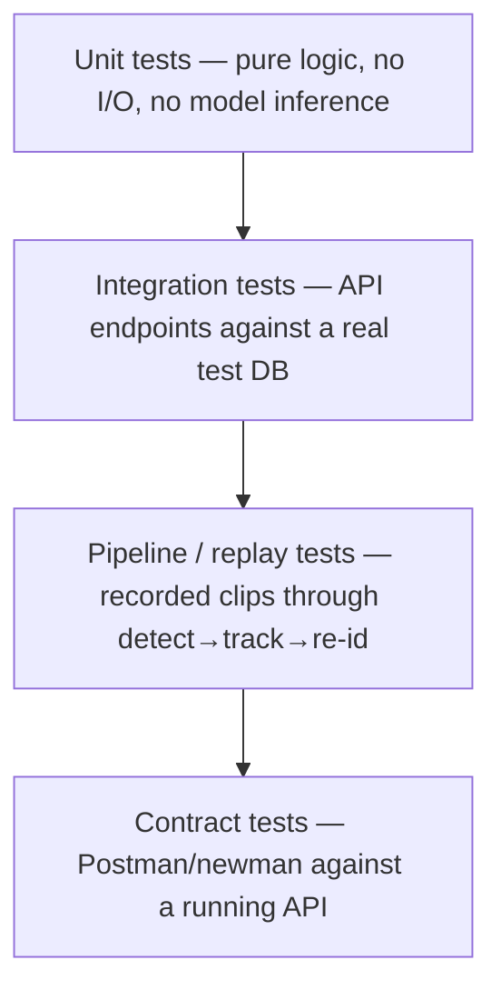

# Testing Strategy

## 1. Philosophy

Test behavior, not implementation. Pipeline code (detection → tracking → re-id) is where mocking everything produces a test suite that passes while the real thing is broken — prefer fewer, real integration/replay tests over a large tree of mocked unit tests for that code path. Coverage percentage is tracked, not chased; a meaningless test written to move a number is worse than no test.

## 2. Layers

- **Unit tests** — pure logic with no I/O and no model inference: matching thresholds, geometry (bounding box overlap), serialization, pagination cursors. Fast, run on every commit.
- **Integration tests** — exercise API endpoints over HTTP against a real (test-scoped) database instance. No mocked DB layer — a mocked DB is how a passing test ships a broken migration.
- **Pipeline / replay tests** — feed a short, fixed video clip through detection → tracking → re-id and assert on expected output (track count, identity count, no crash on an empty/corrupt frame). These are the tests that actually catch a broken model integration, not just broken glue code.
- **Contract tests** — the Postman collection (docs/API_SPEC.md, `postman/`) run via `newman` against a running stack as a regression check. If the collection and the spec disagree, that's a bug in one of them, not a reason to skip the check.
- **Load tests** — multi-camera throughput at target N. Deferred to the phase where multi-camera ingestion actually exists (see docs/PRD.md roadmap); not a blocker for earlier phases.

## 3. Fixtures

- Sample video/frame fixtures checked into the repo must be short, synthetic or otherwise consented, and small enough not to bloat repo size. No real surveillance footage of identifiable people without documented consent.
- Fixture provenance gets a one-line note in `services/*/tests/fixtures/README.md` wherever fixtures live, once they exist — where it came from, what it's used to assert.

## 4. CI expectations

- Every PR: unit + integration tests, on every push.
- Pipeline/replay and contract tests: run on merges to the main branch at minimum; can run per-PR once they're fast enough not to slow the loop down.
- Load tests: manual or nightly, not part of the PR gate.

`.github/workflows/test.yml` runs unit + integration tests (matrix over `services/*`) on every PR and on push to `main`. Pipeline/replay and contract tests aren't wired into CI yet since neither exists in the repo yet; add them to the workflow once they do (see docs/GAPS.md).

## 5. What this suite doesn't cover

Model accuracy (detector precision/recall, re-id false-match rate) is a model evaluation concern, tracked against the success metrics in docs/PRD.md §9, not a pass/fail unit test. Don't encode a specific accuracy number as a test assertion — it belongs in an evaluation report, not in CI.
